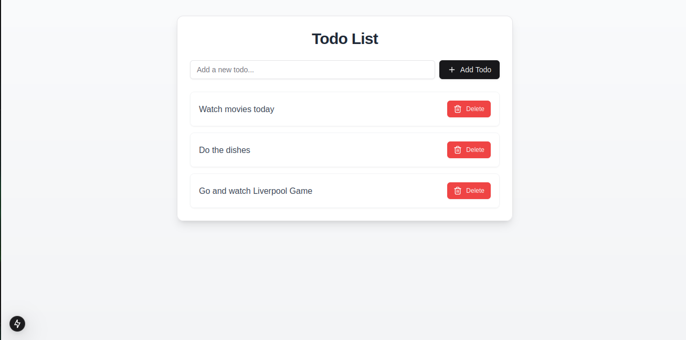

## Intro


This is some sort of a TODO list template to test NextJS + Supabase + Prisma + PostgreSQL + Shadcn Ui



First, install the dependencies:

```bash
npm install

```

Then, run the development server:

```bash
npm run dev

```

